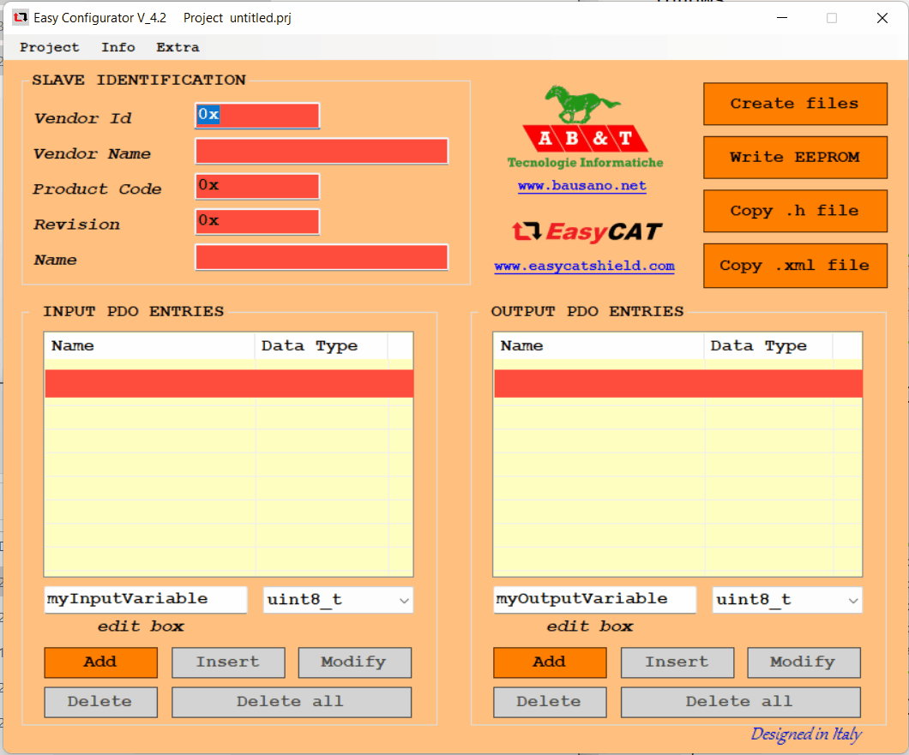
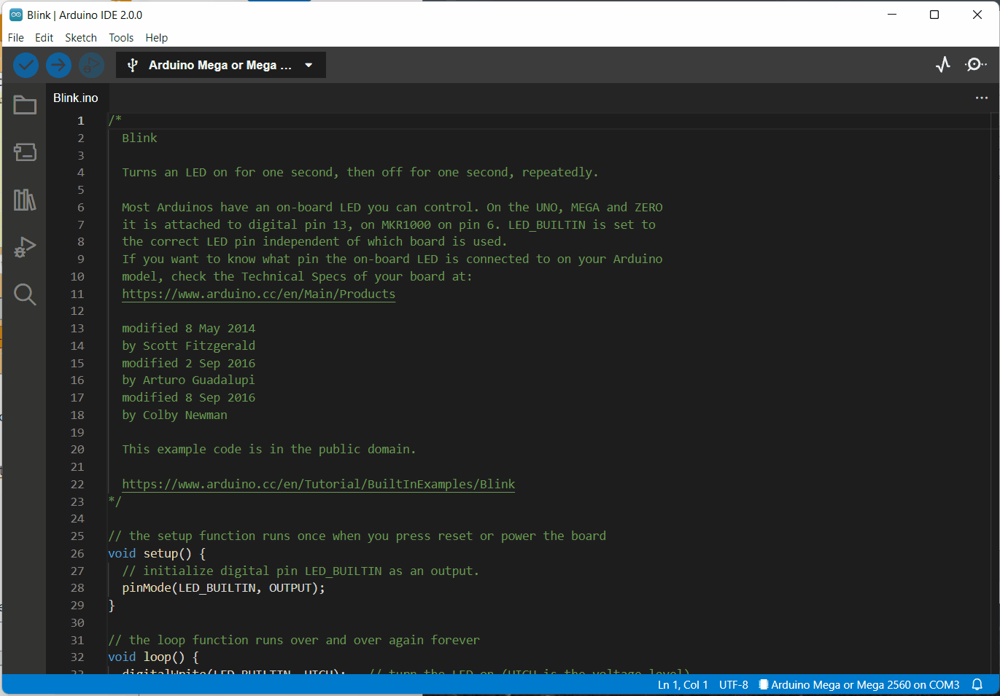
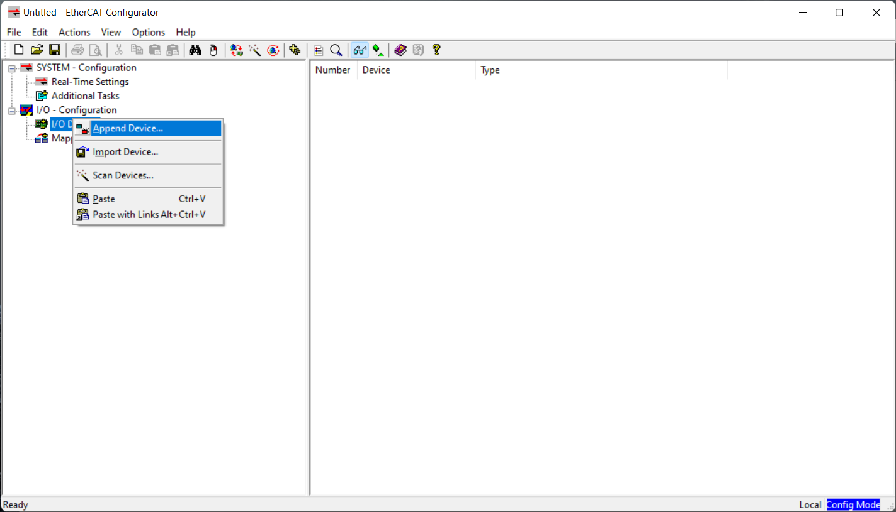
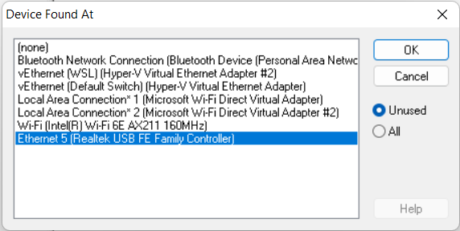
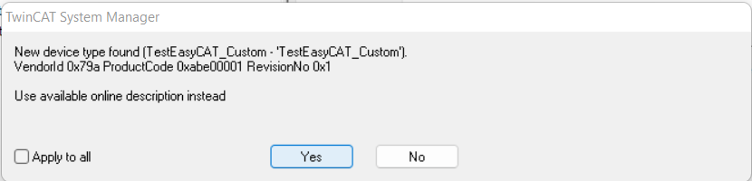
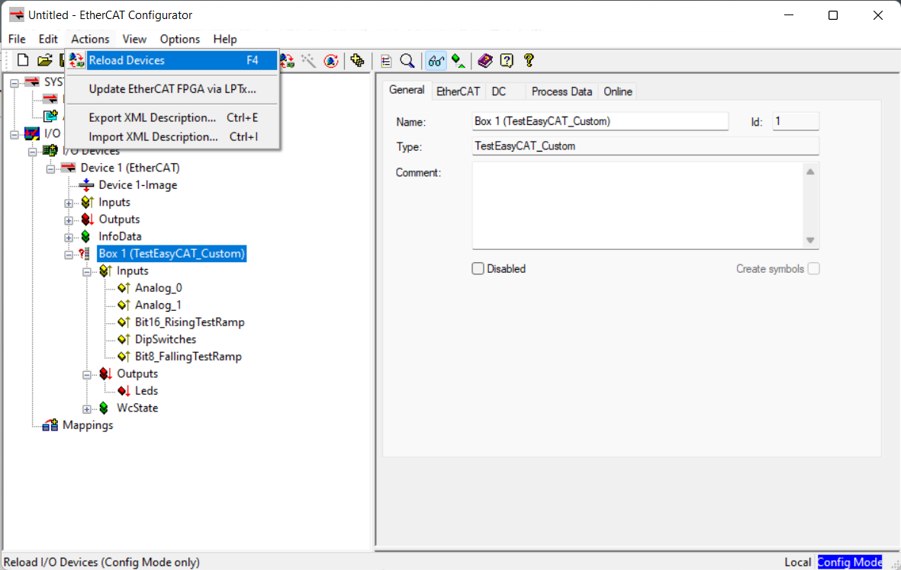
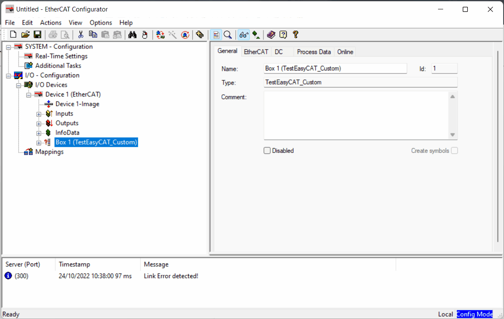

# EasyCAT

The EasyCAT shield board converts an Arduino as an EtherCAT slave. This is a low cost solution to synchronize simple sensors with other devices with much elaborated communication protocols. In addition it allows multiple Arduinos to be connected in series (daisy-chained) thus increasing the possibility of interacting with more sensors/setups.

The libraries and configuration gui for the EasyCAT shield board are better organized in this repository for easy testing. 

Whole content of this repositry (Libraries and Examples) are all taken from [Easy CAT](https://www.bausano.net/en/hardware/easycat.html) webpage.

- [EasyCAT](#easycat)
- [Getting Started](#getting-started)
  - [Hardware Requirements](#hardware-requirements)
  - [Software Requirements](#software-requirements)
  - [Running first test code](#running-first-test-code)
- [Setting up a new project](#setting-up-a-new-project)
  - [Relevant documentation](#relevant-documentation)

Getting Started
===============

Hardware Requirements
---------------------

*   Arduino (Uno, Mega, Due, M0Pro, Zero, 101, Nano)
    
*   [EasyCAT shield board](https://www.bausano.net/en/hardware/easycat.html)
    

Software Requirements
---------------------

*   [Arduino IDE](https://www.arduino.cc/en/software)
    
*   [Beckhoff EtherCAT configurator](https://www.beckhoff.com/en-en/products/i-o/ethercat-development-products/etxxxx-software/et9000.html)
    

Running first test code
-----------------------

Here are the steps to run a slightly modified example code to interact with the `BUILTIN` led from the arduino.

1.  _Connecting the shield board._
    
    1.  Put the EasyCAT shield on top of the Arduino.
        
    2.  Connect the Arduino to the PC via the serial cable.
        
    3.  Connect the EasyCAT shield to the computer via an ethernet cable connected in the port IN.
        
2.  _Setting up the EtherCAT IOs in the shield board_
    
    1.  Clone this repository.
        
    2.  In the PC open the `configurator` folder and run the `EasyCAT_Config_GUI.exe` executable located in the Exe folder.
        
    3.  In the EasyCAT configurator, in Project → Open, browse the folder `examples/TestEasyCAT_Custom` and open the project `TestEasyCAT_Custom.prj`.
        
    4.  Click on “Create files” (Files would be created in the same project folder).
        
    5.  Once the files are created click on “Write EEPROM“ to download the changes to the EasyCAT board. (**If it fails to find a slave try again until the config file is written)**
        
        
3.  _Setting up the Arduino project_
    
    1.  Open the Arduino IDE and set the sketchbook location to the root of the repository. File → Preferences → Sketchbook location → Browse.
        
    2.  Restart Arudino IDE.
        
    3.  Open the `TestEasyCAT_Custom` example from the Sketchbook menu. File → Skecthbook → examples → TestEasyCAT\_Custom
        
    4.  Verify and Upload.
        
        
4.  _Testing the EtherCAT communication_
    
    1.  Open the EtherCAT configurator (Click on Evaluate)
        
    2.  Right-click in I/O Devices and click in Append Device. Append an EtherCAT master. 
   
    3.  Select the Ethernet adaptor where the EasyCAT is connected.
    
    Right-click in the master and “Scan Boxes“
    
        
    1.  Use the online description
    
        
    1.  Reload devices and toggle the free run
    

    1.  Check if it is working by checking the `Bit16_RisingTestRamp` Input → “Online“ tab (It should show a rising ramp). To test the Output toggle the `Leds` Output in the “Online” tab (Click Write and set a value of 0 or 1) such that the Built In led in the Arduino toggles.
        
        

Setting up a new project
========================

1.  Use the EasyCAT configurator to setup your custom input/outputs and generate the files (See [EasyCAT setup](#easycat_setup) for reference).
    
    -  Start a new project – Or copy an existing one – and save it to your Arduino project folder (Where your `.ino` file is).
        
    -  Modify your custom input/outputs.
        
    -  Create the files (This should generate the files in the Arduino folder!)
        
    -  Write the configuration to the EEPROM.
        
2.  In Arduino IDE, be sure that for a new project you copy the folder `libraries` from this repository and put it the root of your Arduino sketchbook (See [Arduino setup](#arduino_setup) for reference).
    
    -  Verify and Upload.
        
3.  Test your code with the EtherCAT Configurator (See [EtherCAT test](#ethercat_test))

## Relevant documentation
- [Easy CAT](https://www.bausano.net/en/hardware/easycat.html) webpage
